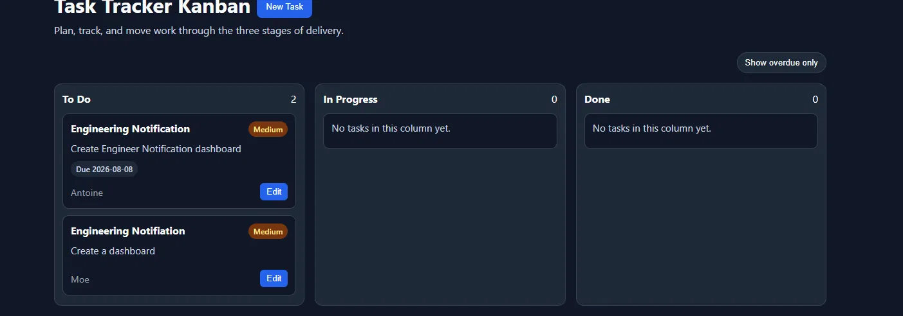
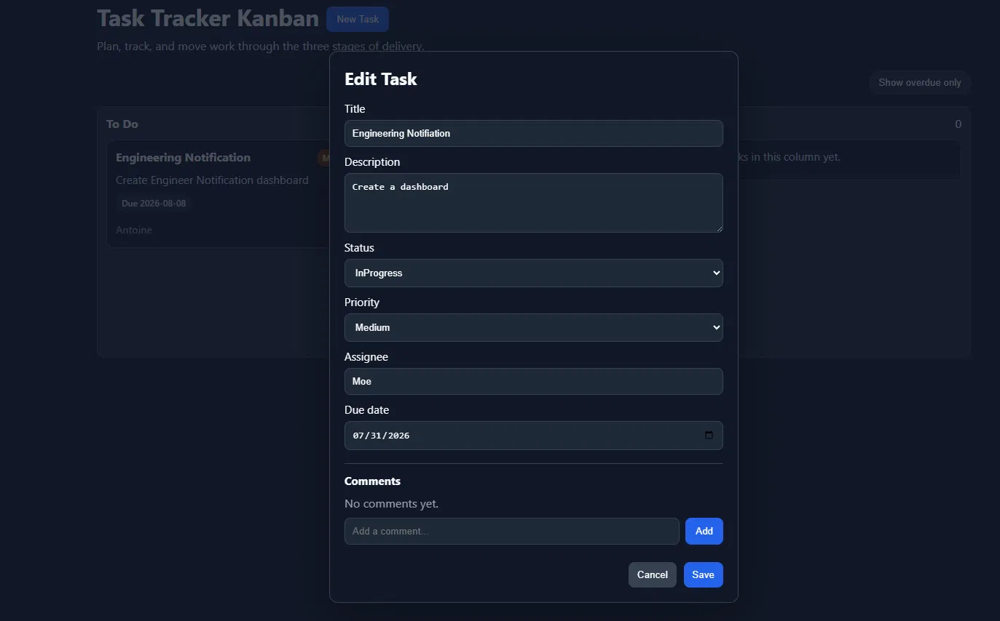
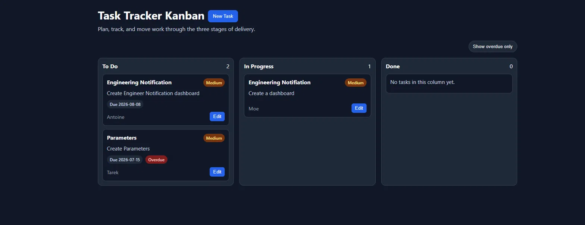
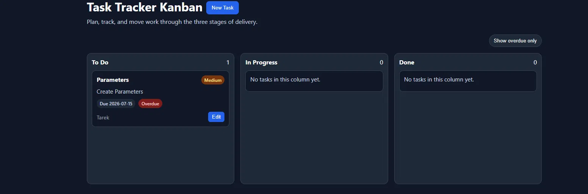
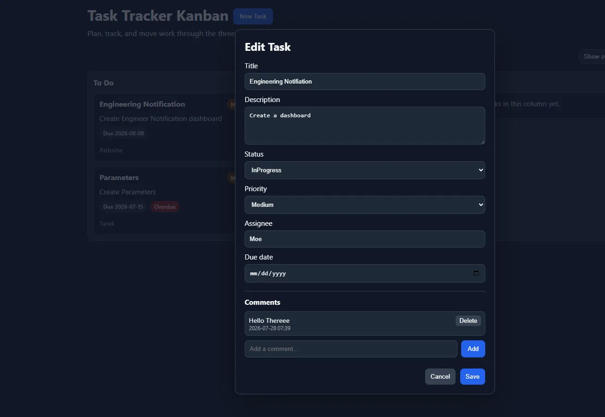
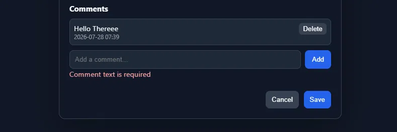

PS C:\Users\Dev041\AAC\task-tracker\backend> python -m pytest -v 
======================================================= test session starts =======================================================
platform win32 -- Python 3.14.6, pytest-9.1.1, pluggy-1.6.0 -- C:\Users\Dev041\AppData\Local\Python\pythoncore-3.14-64\python.exe
cachedir: .pytest_cache
rootdir: C:\Users\Dev041\AAC\task-tracker\backend
plugins: anyio-4.14.2
collected 42 items                                                                                                                 

tests/test_cors.py::test_preflight_request_allows_browser_requests PASSED                                                    [  2%]
tests/test_tasks.py::test_create_task_valid_returns_201_with_full_body PASSED                                                [  4%]
tests/test_tasks.py::test_create_task_missing_title_returns_422 PASSED                                                       [  7%]
tests/test_tasks.py::test_create_task_blank_title_returns_422 PASSED                                                         [  9%]
tests/test_tasks.py::test_create_task_invalid_priority_returns_422 PASSED                                                    [ 11%]
tests/test_tasks.py::test_create_task_unknown_field_returns_422 PASSED                                                       [ 14%]
tests/test_tasks.py::test_create_task_with_valid_due_date_returns_201_and_stores_due_date PASSED                             [ 16%]
tests/test_tasks.py::test_create_task_with_invalid_due_date_returns_422 PASSED                                               [ 19%]
tests/test_tasks.py::test_update_task_can_clear_due_date_with_null PASSED                                                    [ 21%]
tests/test_tasks.py::test_update_other_field_leaves_due_date_unchanged PASSED                                                [ 23%]
tests/test_tasks.py::test_task_without_due_date_is_never_overdue PASSED                                                      [ 26%]
tests/test_tasks.py::test_list_tasks_empty_returns_200_and_empty_list PASSED                                                 [ 28%]
tests/test_tasks.py::test_list_tasks_filter_by_status_no_match_returns_200_and_empty_list PASSED                             [ 30%]
tests/test_tasks.py::test_list_tasks_filter_by_priority_returns_only_matches PASSED                                          [ 33%]
tests/test_tasks.py::test_get_task_by_id_returns_task PASSED                                                                 [ 35%]
tests/test_tasks.py::test_get_task_by_id_not_found_returns_404_with_detail PASSED                                            [ 38%]
tests/test_tasks.py::test_patch_partial_update_keeps_other_fields PASSED                                                     [ 40%]
tests/test_tasks.py::test_patch_not_found_returns_404 PASSED                                                                 [ 42%]
tests/test_tasks.py::test_patch_valid_transition_todo_to_inprogress_returns_200 PASSED                                       [ 45%]
tests/test_tasks.py::test_patch_invalid_transition_todo_to_done_returns_422 PASSED                                           [ 47%]
tests/test_tasks.py::test_patch_same_status_returns_422 PASSED                                                               [ 50%]
tests/test_tasks.py::test_patch_empty_json_body_leaves_task_unchanged_and_succeeds PASSED                                    [ 52%]
tests/test_tasks.py::test_due_date_on_past_non_done_task_is_overdue_and_done_task_is_not PASSED                              [ 54%]
tests/test_tasks.py::test_update_task_due_date_keeps_other_fields_unchanged PASSED                                           [ 57%]
tests/test_tasks.py::test_list_tasks_can_filter_by_overdue_flag PASSED                                                       [ 59%]
tests/test_tasks.py::test_delete_existing_returns_204_no_body PASSED                                                         [ 61%]
tests/test_tasks.py::test_delete_missing_returns_404 PASSED                                                                  [ 64%]
tests/test_tasks.py::test_add_comment_valid_returns_201_with_body PASSED                                                     [ 66%]
tests/test_tasks.py::test_add_comment_blank_text_returns_422 PASSED                                                          [ 69%]
tests/test_tasks.py::test_add_comment_missing_text_returns_422 PASSED                                                        [ 71%]
tests/test_tasks.py::test_add_comment_to_missing_task_returns_404 PASSED                                                     [ 73%]
tests/test_tasks.py::test_add_comment_rejects_client_supplied_id_returns_422 PASSED                                          [ 76%]
tests/test_tasks.py::test_add_comment_rejects_client_supplied_created_at_returns_422 PASSED                                  [ 78%]
tests/test_tasks.py::test_list_comments_empty_returns_200_and_empty_list PASSED                                              [ 80%]
tests/test_tasks.py::test_list_comments_returns_added_comments PASSED                                                        [ 83%]
tests/test_tasks.py::test_list_comments_ordered_by_created_at_ascending PASSED                                               [ 85%]
tests/test_tasks.py::test_list_comments_for_missing_task_returns_404 PASSED                                                  [ 88%]
tests/test_tasks.py::test_delete_comment_returns_204_no_body PASSED                                                          [ 90%]
tests/test_tasks.py::test_delete_comment_actually_removes_it PASSED                                                          [ 92%]
tests/test_tasks.py::test_delete_missing_comment_returns_404 PASSED                                                          [ 95%]
tests/test_tasks.py::test_delete_comment_on_missing_task_returns_404 PASSED                                                  [ 97%]
tests/test_tasks.py::test_delete_comment_via_wrong_task_returns_404 PASSED                                                   [100%]

======================================================== warnings summary =========================================================
..\..\..\AppData\Local\Python\pythoncore-3.14-64\Lib\site-packages\fastapi\testclient.py:1
  C:\Users\Dev041\AppData\Local\Python\pythoncore-3.14-64\Lib\site-packages\fastapi\testclient.py:1: StarletteDeprecationWarning: Using `httpx` with `starlette.testclient` is deprecated; install `httpx2` instead.
    from starlette.testclient import TestClient as TestClient  # noqa

tests/test_tasks.py::test_patch_invalid_transition_todo_to_done_returns_422
tests/test_tasks.py::test_patch_same_status_returns_422
  C:\Users\Dev041\AAC\task-tracker\backend\app\main.py:98: StarletteDeprecationWarning: 'HTTP_422_UNPROCESSABLE_ENTITY' is deprecated. Use 'HTTP_422_UNPROCESSABLE_CONTENT' instead.
    validate_status_transition(existing.status, payload.status)

-- Docs: https://docs.pytest.org/en/stable/how-to/capture-warnings.html
================================================= 42 passed, 3 warnings in 1.17s ==================================================

# Manual browser checks
   Board view — task "Engineering Notification" shows its due date (Due 2026-08-08) with no overdue pill, confirming a due date renders on the card and a future-dated task is not marked overdue

  the Due date field is prefilled with the task's saved date (07/31/2026), and the Comments section shows the empty "No comments yet" state with an Add box. Confirms the due-date input exists and prefills on edit.

 Board view — the "Parameters" task (Due 2026-07-15) displays a red Overdue pill while the future-dated task shows none. Confirms a past-due, non-Done task is marked overdue. (Story #3)

 "Show overdue only" filter active — only the overdue "Parameters" task remains; future-dated tasks are hidden. Confirms the overdue filter returns only overdue tasks.

 Edit modal — an added comment ("Hello Thereee") appears in the list with its timestamp and a Delete button. Confirms a comment can be added and is listed.

 Comment validation — submitting a blank comment shows the red "Comment text is required" error and no comment is added. Confirms blank comments are rejected. (Comments validation)

### Break 1 — Overdue "not Done" guard removed

**What I changed:** In `app/models.py`, inside `is_task_overdue`, I commented out
the check that stops a Done task from being overdue:

    # if getattr(task, "status", None) == TaskStatus.DONE:
    #     return False

**Test targeted:** test_due_date_on_past_non_done_task_is_overdue_and_done_task_is_not

**Expected:** With the guard gone, a past-due task that is marked Done is wrongly
reported as overdue, so the test's `overdue is False` assertion should fail.

**Result (broken code):**

PS C:\Users\Dev041\AAC\task-tracker\backend> python -m pytest -v -k test_due_date_on_past_non_done_task_is_overdue_and_done_task_is_not
======================================================= test session starts =======================================================
platform win32 -- Python 3.14.6, pytest-9.1.1, pluggy-1.6.0 -- C:\Users\Dev041\AppData\Local\Python\pythoncore-3.14-64\python.exe
cachedir: .pytest_cache
rootdir: C:\Users\Dev041\AAC\task-tracker\backend
plugins: anyio-4.14.2
collected 42 items / 41 deselected / 1 selected                                                                                    

tests/test_tasks.py::test_due_date_on_past_non_done_task_is_overdue_and_done_task_is_not FAILED                              [100%]

============================================================ FAILURES =============================================================
_______________________________ test_due_date_on_past_non_done_task_is_overdue_and_done_task_is_not _______________________________

client = <starlette.testclient.TestClient object at 0x000001E0EF199FD0>

    def test_due_date_on_past_non_done_task_is_overdue_and_done_task_is_not(client):
        create_response = client.post(
            "/tasks",
            json={"title": "Overdue task", "due_date": "2000-01-01", "status": "InProgress"},
        )
        task = create_response.json()
        assert task["overdue"] is True
    
        patch_response = client.patch(f"/tasks/{task['id']}", json={"status": "Done"})
        assert patch_response.status_code == 200
>       assert patch_response.json()["overdue"] is False
E       assert True is False

tests\test_tasks.py:203: AssertionError
======================================================== warnings summary =========================================================
..\..\..\AppData\Local\Python\pythoncore-3.14-64\Lib\site-packages\fastapi\testclient.py:1
  C:\Users\Dev041\AppData\Local\Python\pythoncore-3.14-64\Lib\site-packages\fastapi\testclient.py:1: StarletteDeprecationWarning: Using `httpx` with `starlette.testclient` is deprecated; install `httpx2` instead.
    from starlette.testclient import TestClient as TestClient  # noqa

-- Docs: https://docs.pytest.org/en/stable/how-to/capture-warnings.html
===================================================== short test summary info =====================================================
FAILED tests/test_tasks.py::test_due_date_on_past_non_done_task_is_overdue_and_done_task_is_not - assert True is False
=========================================== 1 failed, 41 deselected, 1 warning in 0.29s ===========================================

**Restoration:** I uncommented the guard in `is_task_overdue` in `app/models.py`,
restoring:

    if getattr(task, "status", None) == TaskStatus.DONE:
        return False

**Result (restored code):**

PS C:\Users\Dev041\AAC\task-tracker\backend> python -m pytest -v -k test_due_date_on_past_non_done_task_is_overdue_and_done_task_is_not
======================================================================================================== test session starts ========================================================================================================
platform win32 -- Python 3.14.6, pytest-9.1.1, pluggy-1.6.0 -- C:\Users\Dev041\AppData\Local\Python\pythoncore-3.14-64\python.exe
cachedir: .pytest_cache
rootdir: C:\Users\Dev041\AAC\task-tracker\backend
plugins: anyio-4.14.2
collected 42 items / 41 deselected / 1 selected                                                                                                                                                                                      

tests/test_tasks.py::test_due_date_on_past_non_done_task_is_overdue_and_done_task_is_not PASSED                                                                                                                                [100%]

========================================================================================================= warnings summary ==========================================================================================================
..\..\..\AppData\Local\Python\pythoncore-3.14-64\Lib\site-packages\fastapi\testclient.py:1
  C:\Users\Dev041\AppData\Local\Python\pythoncore-3.14-64\Lib\site-packages\fastapi\testclient.py:1: StarletteDeprecationWarning: Using `httpx` with `starlette.testclient` is deprecated; install `httpx2` instead.
    from starlette.testclient import TestClient as TestClient  # noqa

-- Docs: https://docs.pytest.org/en/stable/how-to/capture-warnings.html
============================================================================================ 1 passed, 41 deselected, 1 warning in 0.04s ============================================================================================

## Break 2 — Comment ownership check removed

**What I changed:** In `app/main.py`, in `delete_comment`, I changed
`if comment is None or comment.task_id != task_id:` to `if comment is None:`,
removing the check that the comment actually belongs to the task in the URL.

**Test targeted:** test_delete_comment_via_wrong_task_returns_404

**Expected:** Without the ownership check, deleting a comment through a different
task's URL returns 204 instead of 404, so the test fails.

**Result (broken code):**

PS C:\Users\Dev041\AAC\task-tracker\backend> python -m pytest -v tests/test_tasks.py::test_delete_comment_via_wrong_task_returns_404

======================================================= test session starts =======================================================
platform win32 -- Python 3.14.6, pytest-9.1.1, pluggy-1.6.0 -- C:\Users\Dev041\AppData\Local\Python\pythoncore-3.14-64\python.exe
cachedir: .pytest_cache
rootdir: C:\Users\Dev041\AAC\task-tracker\backend
plugins: anyio-4.14.2
collected 1 item                                                                                                                   

tests/test_tasks.py::test_delete_comment_via_wrong_task_returns_404 FAILED                                                   [100%]

============================================================ FAILURES =============================================================
_________________________________________ test_delete_comment_via_wrong_task_returns_404 __________________________________________

client = <starlette.testclient.TestClient object at 0x00000236E0089D30>
created_task = {'due_date': None, 'id': 'b189bc84-6f3b-41b9-a1ee-bf8b06ccd73c', 'title': 'fixture task', 'description': '', ...}

    def test_delete_comment_via_wrong_task_returns_404(client, created_task):
        # comment belongs to created_task; try deleting it through a different task
        create = client.post(
            f"/tasks/{created_task['id']}/comments", json={"text": "Mine"}
        )
        comment_id = create.json()["id"]
        other = client.post("/tasks", json={"title": "Other task"})
        other_id = other.json()["id"]
        response = client.delete(f"/tasks/{other_id}/comments/{comment_id}")
>       assert response.status_code == 404
E       assert 204 == 404
E        +  where 204 = <Response [204 No Content]>.status_code

tests\test_tasks.py:395: AssertionError
======================================================== warnings summary =========================================================
..\..\..\AppData\Local\Python\pythoncore-3.14-64\Lib\site-packages\fastapi\testclient.py:1
  C:\Users\Dev041\AppData\Local\Python\pythoncore-3.14-64\Lib\site-packages\fastapi\testclient.py:1: StarletteDeprecationWarning: Using `httpx` with `starlette.testclient` is deprecated; install `httpx2` instead.
    from starlette.testclient import TestClient as TestClient  # noqa

-- Docs: https://docs.pytest.org/en/stable/how-to/capture-warnings.html
===================================================== short test summary info =====================================================
FAILED tests/test_tasks.py::test_delete_comment_via_wrong_task_returns_404 - assert 204 == 404
================================================== 1 failed, 1 warning in 0.37s ===================================================

**Restoration:** I restored the ownership check in `delete_comment` in
`app/main.py`, changing `if comment is None:` back to
`if comment is None or comment.task_id != task_id:`.

**Result (restored code):**

PS C:\Users\Dev041\AAC\task-tracker\backend> python -m pytest -v tests/test_tasks.py::test_delete_comment_via_wrong_task_returns_404   
======================================================================================================== test session starts ========================================================================================================
platform win32 -- Python 3.14.6, pytest-9.1.1, pluggy-1.6.0 -- C:\Users\Dev041\AppData\Local\Python\pythoncore-3.14-64\python.exe
cachedir: .pytest_cache
rootdir: C:\Users\Dev041\AAC\task-tracker\backend
plugins: anyio-4.14.2
collected 1 item                                                                                                                                                                                                                     

tests/test_tasks.py::test_delete_comment_via_wrong_task_returns_404 PASSED                                                                                                                                                     [100%]

========================================================================================================= warnings summary ==========================================================================================================
..\..\..\AppData\Local\Python\pythoncore-3.14-64\Lib\site-packages\fastapi\testclient.py:1
  C:\Users\Dev041\AppData\Local\Python\pythoncore-3.14-64\Lib\site-packages\fastapi\testclient.py:1: StarletteDeprecationWarning: Using `httpx` with `starlette.testclient` is deprecated; install `httpx2` instead.
    from starlette.testclient import TestClient as TestClient  # noqa

-- Docs: https://docs.pytest.org/en/stable/how-to/capture-warnings.html
=================================================================================================== 1 passed, 1 warning in 0.05s ====================================================================================================

## Behavior Contract — Before / After Refactor

**Refactor performed:** Removed duplicated "task not found" 404 logic in
`app/main.py`. The inline `storage.get_task_by_id(...)` + `if task is None:
raise HTTPException(404, ...)` block was repeated in `get_task` and in the
status branch of `update_task`. Both now call the existing `_require_task`
helper, which does the same fetch-and-404. The helper was also moved above the
route definitions so it's defined before it's used. No routes, status codes,
request bodies, or response shapes were changed — the change is purely internal
structure.

**Contract:** The observable behavior of every endpoint is defined by the 42
tests in `tests/`. Because the refactor changes structure only, the same tests
must pass unchanged before and after.

PS C:\Users\Dev041\AAC\task-tracker\backend> python -m pytest -q
..........................................                                                                                   [100%]
======================================================== warnings summary =========================================================
..\..\..\AppData\Local\Python\pythoncore-3.14-64\Lib\site-packages\fastapi\testclient.py:1
  C:\Users\Dev041\AppData\Local\Python\pythoncore-3.14-64\Lib\site-packages\fastapi\testclient.py:1: StarletteDeprecationWarning: Using `httpx` with `starlette.testclient` is deprecated; install `httpx2` instead.
    from starlette.testclient import TestClient as TestClient  # noqa

tests/test_tasks.py::test_patch_invalid_transition_todo_to_done_returns_422
tests/test_tasks.py::test_patch_same_status_returns_422
  C:\Users\Dev041\AAC\task-tracker\backend\app\main.py:91: StarletteDeprecationWarning: 'HTTP_422_UNPROCESSABLE_ENTITY' is deprecated. Use 'HTTP_422_UNPROCESSABLE_CONTENT' instead.
    validate_status_transition(existing.status, payload.status)

-- Docs: https://docs.pytest.org/en/stable/how-to/capture-warnings.html
42 passed, 3 warnings in 1.55s
PS C:\Users\Dev041\AAC\task-tracker\backend> 